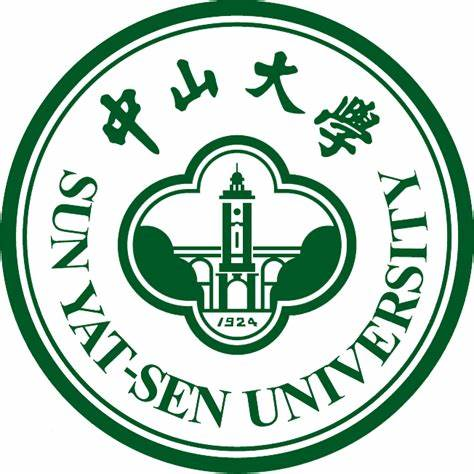

### Hi, This is Shiwen Shan (单诗雯) 👋
Currently, she is a first-year Ph.D student in  Sun Yat-sen University (SYSU).

She is under the supervison of 
<a href="https://yxsu.github.io/" class="highlighted">Prof. Su</a> and <a href="https://www.zibinzheng.com/" class="highlighted">Prof. Zheng</a>.

Her research interest lies in **The Reliablity of Software Systems & Operating Systems**. In particular, she finds it interesting and exciting to explore the filed of **Operating Systems**. Feel free to <a href="/contact.html">contact her</a> for discussions and cooperations!